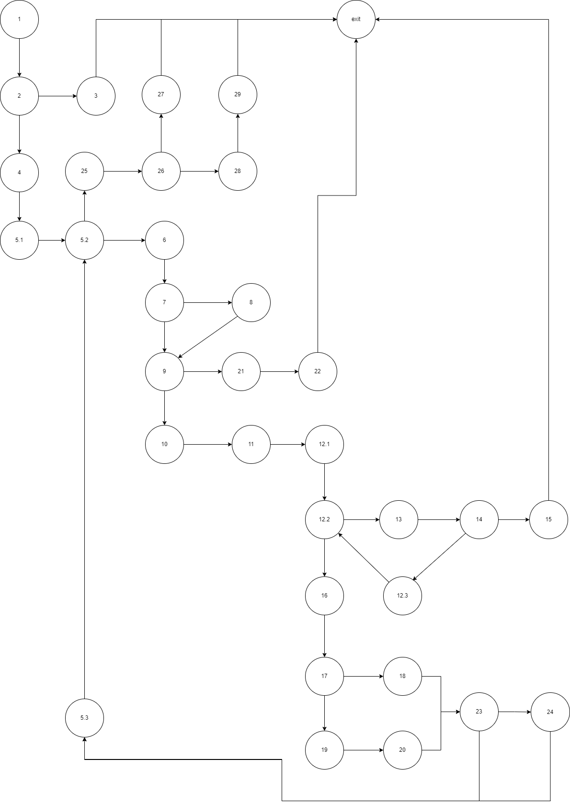

# Втора лабораториска вежба по Софтверско инженерство

## Стефан Лазаревски, бр. на индекс 226079

###  Control Flow Graph

### Цикломатска комплексност

Цикломатската комплексност на овој код е 10, истата ја добив преку формулата P+1, каде што P е бројот на предикатни јазли. Во случајoв P=9, па цикломатската комплексност изнесува 10, а може и преку формулата број_ребра - број_јазли + 2. Добив 42 - 34 + 2 = 10.

### Every Branch
x означува произволна вредности бидејќи програмата не зависи од тој инпут 
1: allItems == null, payment = x 
Програмата ќе фрли new RuntimeException("allItems list can't be null!");

2: allItems = [new Item("chicken", null, x, x)] , payment=x
Програмата ќе фрли new RuntimeException("No barcode!");

3: allItems = [new Item("chicken", "12l1", x, x)] , payment=x
Програмата ќе фрли new RuntimeException("Invalid character in item barcode!");

4: Листата се содржи од: item1 = ["chicken", "4505", 389, 0] и item2 = ["potatoes", "9874", 100, 0] , payment=100
Производите нема да имаат попуст и нивниот збир ќе е поголем од payment така што програмата ќе врати false.

5: Листата се содржи од item1 = ["chicken", "0505", 350, 0.25] и item2 = ["null", "0874", 320, 0.1] , payment=1000
Има производ со име null. Производите се со попуст, нивните цени се поголеми од 300 и во баркодот почнува со 0, нивниот збир ќе е пoмал од payment така што програмата ќе врати true.

### Multiple Condition
Според условот:
`if (item.getPrice() > 300 && item.getDiscount() > 0 && item.getBarcode().charAt(0) == '0')`
со кој се проверува дали за продуктот следува дополнителен попуст и за истиот имаме 4 тестови:

1. Цената на производот е помала или еднаква на 300. (F && X && X e false);

        item = ["cheese", "4505", 200, 0.2]

2. Цената на производот е поголема од 300, но нема попуст. (T && F && X е false);

        item = ["cheese", "4505", 330, 0]

3. Цената на производот е поголема од 300, има попуст, но почнува со 0 баркодот. (T && T && F e false);

        item = ["cheese", "0450", 330, 0.3]

4. Цената на производот е поголема од 300, има попуст и не започнува баркодот со 0. (T && T && T e true)

        item = ["cheese", "4505", 330, 0.3]

Критериумот Multiple Condition е задоволен со овие тест примери.

### Објаснување на напишаните unit tests
Објаснувањата за unit tests се напишани во самите делови за Every Branch и Multiple Choice
